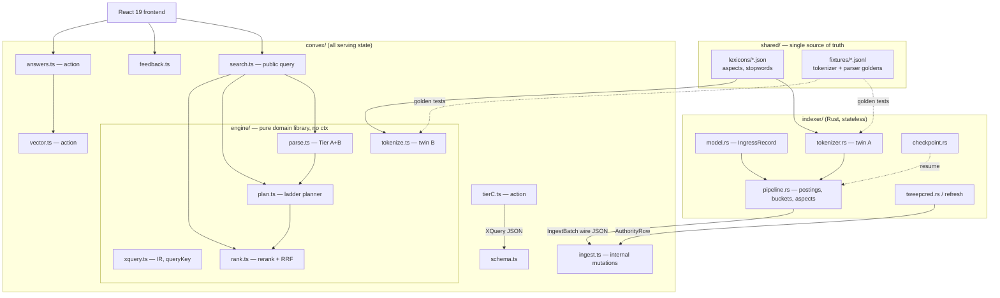

# Xearch — Architecture (design package)

Companion to [DESIGN.md](DESIGN.md) (the product/algorithm spec). This document is the
*code* design: module boundaries, the contracts between them, and why this shape won.
Produced by the architect workflow: two structurally distinct candidates, screened
against design red flags, then synthesized.

## Problem

Four runtimes must agree on meaning while staying independently buildable: a Rust
indexer (offline, 24/7), Convex functions (parse/retrieve/rank/serve), an LLM sidecar
(Tier C + answers), and a React 19 frontend. The dangerous failure mode is drift — two
tokenizers that disagree, an IR the parser emits but retrieval half-understands, wire
payloads that change shape silently. Constraints from DESIGN.md that the code shape
must honor: the rules-only path is one reactive Convex query (speed invariant); all
serving state in Convex; retrieval is a pure function of the IR; slow lanes (LLM,
vectors) upgrade results asynchronously rather than blocking.

## Usage (caller's view)

The frontend sees a **three-verb API**; everything else is internal:

```ts
// React (convex/react hooks)
const serp = useQuery(api.search.search, {
  raw: "linux box cheap from:@theo",
  sort: "top",            // "top" | "latest"
  cursor: null,
});
// serp: { results: Result[], appliedQuery: XQueryPublic, ladder: "L0"|"L1"|..., trace }

const hints = useQuery(api.search.suggest, { prefix: "conv" });      // typeahead

const vote = useMutation(api.feedback.vote);                          // 👍/👎
vote({ queryKey: serp.queryKey, tweetId, vote: 1, sessionId });

// Answer mode — explicit user action only; streams via subscription
const req = useAction(api.answers.request);                           // kick off
const answer = useQuery(api.answers.get, { queryKey: serp.queryKey }); // stream in
```

The Rust indexer sees a **one-verb API** (plus two maintenance verbs):

```
POST /api/mutation  internal.ingest.ingestBatch   { batch: IngestBatch }   // everything
POST /api/mutation  internal.ingest.applyMetrics  { updates: MetricsDelta[] }
POST /api/mutation  internal.ingest.upsertAuthority { rows: AuthorityRow[] }
```

The LLM sidecar is invoked *by* Convex (action), never the reverse.

## Shape



Load-bearing decisions:

1. **`convex/engine/` is a pure domain library.** No `ctx`, no I/O — functions from
   values to values (parse: string → XQuery; plan: XQuery → ReadPlan; rank:
   candidates → scored). Convex function files (`search.ts`, `ingest.ts`, …) are the
   thin shell that owns `ctx.db` and executes plans. Per boundary-discipline:
   validate at the edge, trust types inside; business logic stays unit-testable
   without a Convex deployment.
2. **The planner emits a `ReadPlan`, it does not read.** `plan.ts` turns an XQuery
   into declarative index-read requests (`{index, keyRange, order, limit}`);
   `search.ts` executes them against `ctx.db` and feeds rows back. This keeps ladder
   logic (L0→L2 escalation) pure and testable, and makes the "bounded reads"
   invariant *visible in a type* — every read carries an explicit `limit`.
3. **Five named contracts, each with one owner and a fixture:**

   | Contract | Shape lives in | Consumed by | Drift guard |
   |---|---|---|---|
   | `IngressRecord` (JSONL) | docs/INGRESS.md + `indexer/src/model.rs` | indexer | quarantine + counter |
   | `IngestBatch` (wire) | `convex/ingest.ts` validators | indexer → Convex | Convex validator rejects |
   | `XQuery` (IR) | `convex/engine/xquery.ts` + docs/PARSER.md schema | parser tiers → plan/rank/caches | JSON Schema + version field |
   | Tokenizer behavior | spec in DESIGN §12.2 | Rust twin + TS twin | `shared/fixtures/tokenizer-golden.jsonl`, run by both test suites |
   | Parser semantics | docs/PARSER.md | Tier A/B/C | `shared/fixtures/parser-golden.jsonl`, slot-F1 gate |

4. **Two tokenizer twins over one rule set, guarded by goldens.** We deliberately do
   NOT use a segmentation library on one side only: both twins implement the same
   explicitly-specified character-class rules, and the golden fixture is the
   authority. A divergence is a failing test, not a silent recall bug.
5. **Slow lanes are tables, not calls.** Tier C writes `queryCache`; answers stream
   into `answers`; authority lands in `authors`. The UI never awaits a slow thing —
   it subscribes, and Convex reactivity delivers the upgrade. Per
   separate-before-serializing-shared-state: each lane has a single writer.

Interface depth: the public surface is three queries/mutations + two actions;
behind it hide tokenization, three parser tiers, lexicons, ladder planning, BM25/RRF
math, feedback aggregation, and cache policy. Callers cannot reach internal stages —
there is no "call the parser yourself" endpoint to misuse.

## Synthesis decision

- **Candidate A — stage-per-module pipeline** (parser/, retrieval/, ranking/ as
  separate public Convex modules the frontend coordinates). Rejected on red flags:
  temporal decomposition + caller-coordinated stages + IR/posting types leaking
  across every boundary. Its one virtue — explicit stages — survives as *file layout
  inside* `engine/`, not as public API.
- **Candidate B — deep engine, thin adapters** (pure `engine/` library; Convex files
  as shell). **Base.** Deepest interface per surface area; unit-testable core.
- **Candidate C — everything-as-tables** (parses and SERPs materialized into tables,
  UI subscribes to result rows). Rejected for the hot path — it duplicates what
  Convex reactive queries already are, and adds GC/invalidation machinery. **Adopted
  selectively** for the genuinely-async lanes where it earns its keep: `queryCache`,
  `answers`, `searchFeedback`.

## Tradeoffs accepted

- We accept **two tokenizer implementations** (Rust + TS) in exchange for a
  zero-I/O query path; the golden fixture is the drift tax we pay instead of a
  shared-library build headache (WASM was the alternative; rejected for hackathon
  build risk).
- We accept **hand-rolled segmentation rules** (no `unicode-segmentation` on the
  Rust side / no Intl.Segmenter dependence in TS) in exchange for twin parity that
  is actually verifiable. CJK queries degrade to bigram fallback — documented in
  RISKS.md.
- We accept **plan-then-execute indirection** in `search.ts` (planner emits, shell
  executes) in exchange for pure-function ladder logic. The indirection is one file
  deep; call chains stay ≤ 3 files.
- We accept **feedback/Tier C being eventually consistent** (table-mediated) in
  exchange for never blocking first paint.
- We accept **`_generated` imports that don't resolve until `npx convex dev` runs**
  — the scaffold is a contract, not yet a deployment.

## Alternatives considered

- **Single `search` action doing parse+retrieve+rank+vectors in one round trip**:
  simplest mental model, but actions aren't reactive and can't be cached like
  queries — loses the live-updating SERP that is the product's demo moment. Lost on
  interface depth too: the "one verb" hides nothing because everything becomes one
  opaque body.
- **Rust tokenizer compiled to WASM, imported by Convex** (true single
  implementation): cleanest conceptually; rejected for build/runtime risk inside
  Convex's bundler under hackathon time. Revisit post-hackathon; the golden fixture
  makes the swap safe.
- **Materialized SERP tables (Candidate C) for the hot path**: rejected above;
  noted here because it looks attractive every time reactivity is discussed. The
  reactive query *is* the materialized view.

## Open questions and risks

- Should `suggest` blend author handles with terms (two range reads instead of one)?
  Leaning yes; costs one read.
- Is 1000 the right per-term posting cap for a 1–10M corpus, or should it scale with
  df (e.g. min(1000, df/10))? Needs measurement against the eval set.
- Feedback clamp ±5: right bound? Revisit once real votes exist.
- Full risk register with compromises: [docs/RISKS.md](docs/RISKS.md).

## Next implementation step

Wire `engine/tokenize.ts` + `indexer/src/tokenizer.rs` against
`shared/fixtures/tokenizer-golden.jsonl` until both pass — every other contract
depends on tokenizer parity.

## Scrap triggers (Phase E watch-list)

Re-run the design if any of these patterns recur: (1) `search.ts` needing knowledge
of planner internals to execute plans (leak — the ReadPlan type is wrong); (2) engine
functions growing `ctx`-shaped parameters (the pure boundary failed); (3) repeated
special-casing per ladder level in rank (ladder belongs in plan, not rank); (4) the
Rust and TS twins needing simultaneous edits for every feature (the shared rule set
was a fiction — move to WASM single-source).
